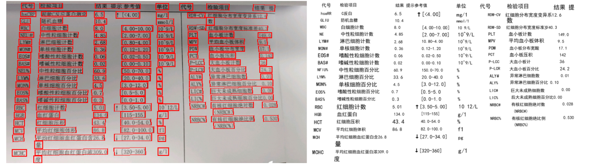

# 简介
- 利用合合识别返回的OCR结果作为初始训练数据，微调阿里开源的文字识别模型。
- 这一版使用了1万张的医学图片进行微调，（约46万张切割的文本框图片）进行微调。

# 参考模型
[[https://www.modelscope.cn/models/iic/cv_resnet18_ocr-detection-db-line-level_damo/summary]

# 可视化展示
 
